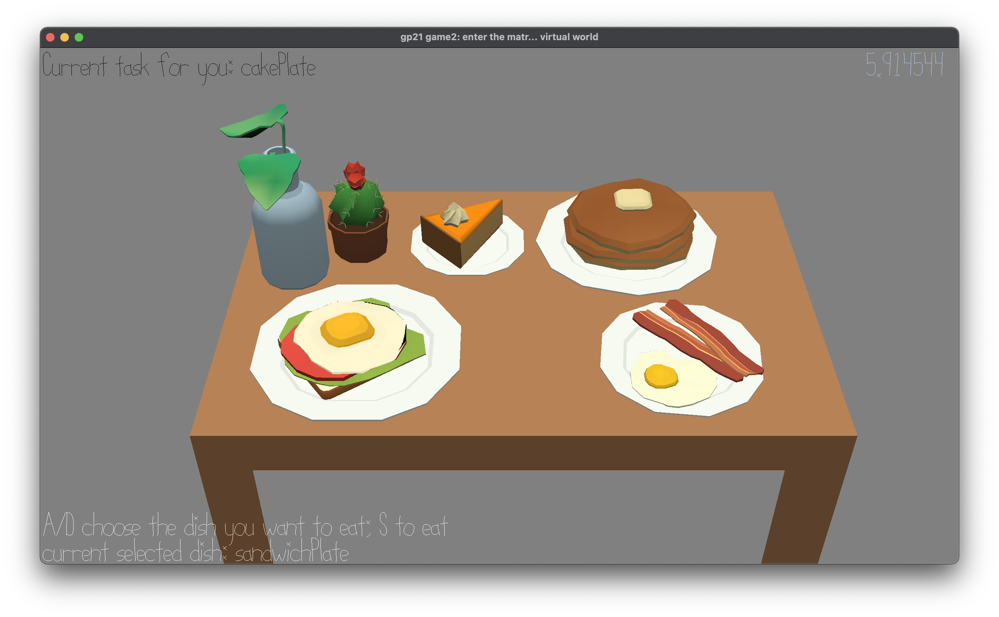

# Eating in Order

Author: Wish Kuo

Design: You are attending a big eater! However, while approaching to the end of the game, you are required to finish the last four dishes in order.

Screen Shot:

How To Play:

Use W/D to select the dish, and select the dish that matches the task. Try to finish as soon as possible! There's a timer indicates how well you've done.

Sources: 
- brunch.blend: provided with base code in scenes
- text drawer: provided with base code

This game was built with [NEST](NEST.md).

